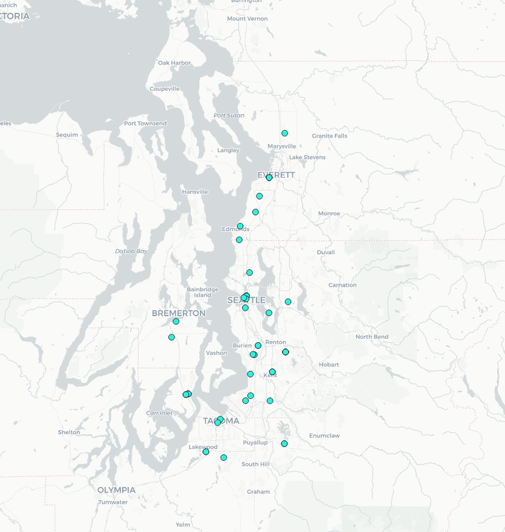
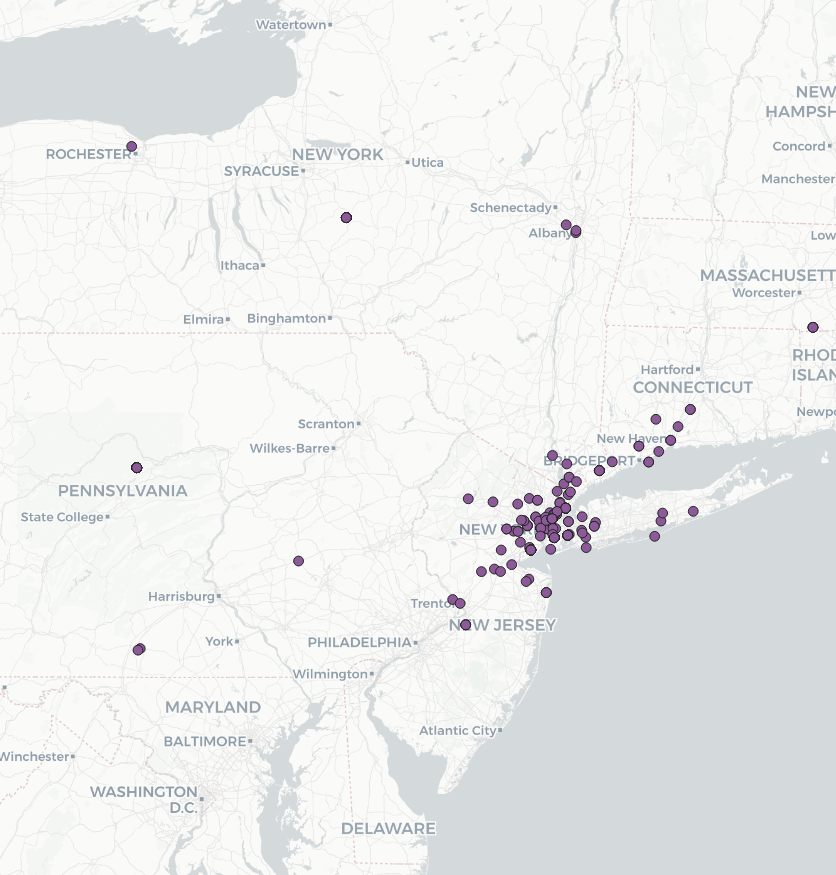
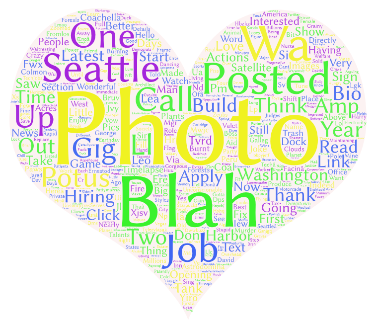
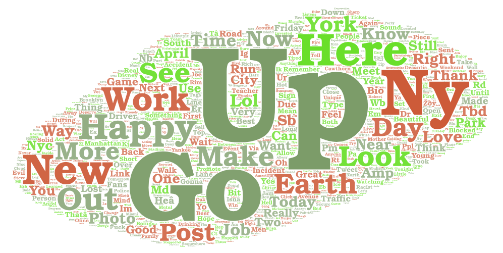

# Lab 2: Geo-tagged tweet collection and visualization

### Keith Ellingwood

### 4/22/2022

### GEOG458

# Introduction

For my Lab 2, I chose to compare geotagged tweets made in the East Coast versus the West Coast, specifically the greater Seattle area versus New York. I chose to compare these two because I was curious just how different the tweets are between the two cultures of East versus West USA. I thought this could give an interesting look into how different these areas of the US really are, as there is a bit of a cultural rivalry between the two. I chose to collect all tweets made in each area over 10 minutes around 2pm on the same day, 4/22/2022, in order to get a good idea of the tweets made during midday, one of the more busy times of day for social media.

# Maps

Comparing the two maps, we can already see some differences in terms of how often people tweet. The New York map has around 370 data points, while the Seattle map has around 75. This indicates to me that social media, especially twitter, may be more important to NY, and in turn East coast culture, compared to Seattle culture. One other interesting thing I noticed is that for the Seattle data points, there was an outlier point all the way up in Northern Canada. This may be because some person in Seattle may have tweeted from a VPN that was connected to a Canadian server, and the Twitter API picked it up. While this doesn't say much, knowing the context of Seattle being a large tech hub this could be a slight indication that the culture of Seattle may generally be more tech savvy than New York. Finally, we can see that the Seattle tweets tend to be more spread out from the city, while New York tweets are mostly clustered near the center of the city. This could indicate that New Yorkers tend to stay in the city and are more active in the city, versus Seattle which may have more commuters and higher populations on the outskirts of the city.

# Word Art

The heart is the Seattle word art, and the cloud is the New York word art. Comparing the two, we can see some similarities; firstly, unsurpsisingly, both have the name of each city as a very common word ("Seattle" and "Ny", respectively), most likely coming from local advertisements and alerts. Also, both wordmaps contain a lot of words pertaining to jobs, such as "Work", "Gig", "Post", "Posted", and "Job", which shows that both areas have a large amount of recruiting presence on social media. THis makes sense, as both are large cities that have lots of jobs constantly opening up. As for differences, it is interesting to note that some of the more common words in New York are "happy", "new" "make" and "up", all of which are fairly positive connotations, while Seattle does not have many positive words in comparison. Many people outside of Seattle cite the "Seattle Freeze", or the general percieved unfriendliness of the city, as a reason they aren't the biggest fan of Seattle. Although many Seattleites consider this a myth, this data may suggest that the social media presence of Seattle tends to be less positive, reinforcing the idea. Finally, one interesting thing I noticed is Seattle's most common word is "Photo". I'm not sure why this is, but maybe people in Seattle tend to post/take more photos. Seattle also had very sunny weather on the day the data was scraped, so maybe this means Seattlites are taking more photos on this day.